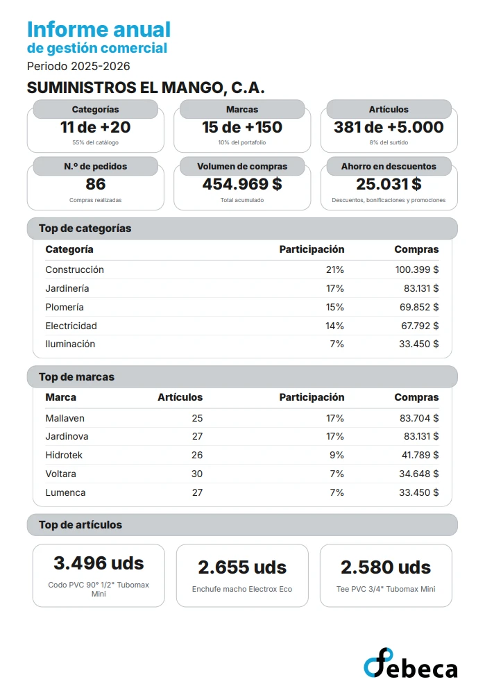

Generator for the **yearly commercial report** of **Febeca**'s customers. From the fiscal
year's purchases, it builds a one-page scorecard for each customer: how much of the portfolio
they activated, how many orders they placed, how much they bought and how much they saved in
discounts, and which categories, brands and items they buy the most.

## The problem

Each customer's relationship with the company was in the sales data, but the customer never
saw it. There was no simple way to show them, on a single page, how much they bought from the
company over the year, which brands they work with and what part of the catalogue they are not
using yet — exactly the conversation a salesperson wants to have.

Putting that summary together by hand for each customer was not feasible: the source is a table
of hundreds of thousands of rows, at customer, brand, item and order level, and the customers
number in the thousands.

## The solution

A command-line tool that reads the year's purchase spreadsheet and generates one PDF per
customer, all in a single run.

**How much of the portfolio they use.** The scorecard opens with the categories, brands and
items the customer activated, each against the size of the catalogue. Those figures tell them
how much is left to discover, and give the salesperson a starting point to offer them more.

**Their year with the company.** Next to them, the number of orders they placed, their purchase
volume and what they saved in discounts, rebates and promotions. The savings are framed
positively, as what the customer gained, not as a discount the company gave away.

**Where they buy.** Below, the categories and brands that weigh most in their purchases, with
their share and amount — and, for each brand, how many different items they buy — and the three
items they bought the most units of.

*The full scorecard, with sample data. It all fits on one page, to be read at a glance.*

**Figures that add up for the business.** The calculation rules came from reviewing the real
data:

- A category, brand or item counts as activated if its net purchase for the year is positive,
  but the total volume adds up everything, including rebates and returns, which subtract.
- Savings are the net of rebates and the debits that offset them: showing rebates alone would
  have overstated what the customer actually saved.
- Orders are counted from product lines only: a rebate note or a service charge is not an order
  placed by the customer.
- Each brand's and category's share is computed over purchases in real brands and categories,
  not over net purchases: since rebates lower the net figure, dividing by it pushed some brands
  past 100%.
- Accounting entries and items that are not products — rebates, services, unbranded categories
  — count towards the volume, but appear in no top list and do not count as activated. Internal
  customers get no scorecard, and rows under 1% of purchases are not shown: they took up space
  without saying anything.

## My role

I was the **sole developer** of the tool: I designed the scorecard, defined the calculation, and
handled data loading and generation.

- **Data:** the source spreadsheet is about 100 MB uncompressed, so it is read as a stream with
  ExcelJS, one row at a time, so memory does not grow with the file. Columns are located by
  their header name, not their position, so reordering the spreadsheet does not break the
  reading. Every row is validated with Zod, a library that checks at runtime that each value
  has the expected type and shape: an invalid row is reported and skipped without stopping the
  run.
- **Rendering:** a Handlebars template converted to PDF with Puppeteer, using a single browser
  and a pool of reusable pages, which is what makes generating thousands of scorecards viable.
  The typeface is embedded in every PDF, so it looks the same on any machine.
- **Formatting:** thousands separators, amounts, percentages and units are applied in one
  place, not scattered across the template, so every figure follows the same convention.

## Project status

The tool was fully ready for management's approval and for sending the scorecards to customers,
but I left the company just before that step.

It is an internal tool and its code lives in a private repository, so out of confidentiality to
the company this case does not include links. For the same reason, the screenshots use invented
data: sample customers, categories, brands, items and figures.
