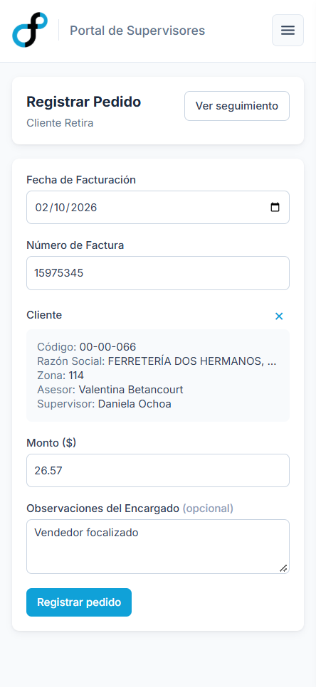
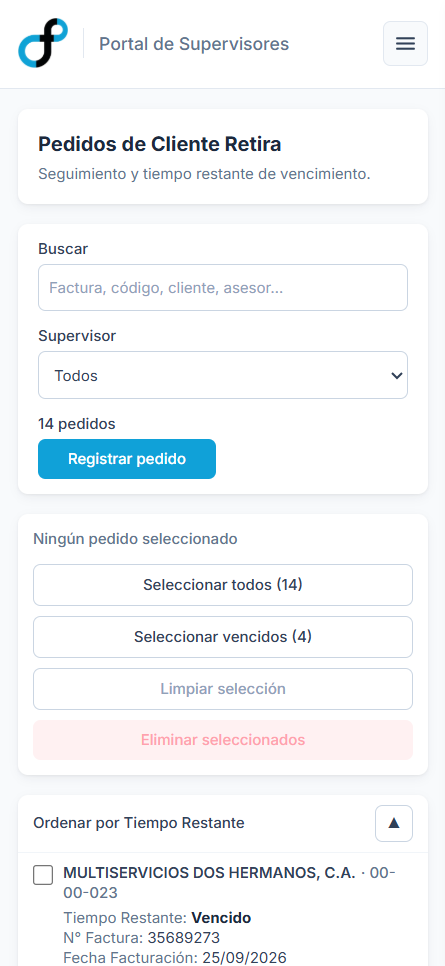

Internal web application at **Febeca** for tracking the orders customers come to pick up in
person. It lives inside the [sales supervisor portal](/en/projects/supervisor-portal/) and
shares its users and sign-in, but it is a different application: the portal shows data that
comes from elsewhere, and this one creates it.

## The problem

Pickup orders are the ones the customer collects in person instead of having them delivered,
as most are. Once invoiced, the customer has **three
business days** to pick the order up.

Before, there was no tracking at all. Orders were invoiced, and neither the sales rep nor
the supervisor had any way of knowing which ones were waiting to be collected, for which
customers, or how much time they had left. The closest thing to a control was a Google
Drive sheet kept by hand by one of the sales administrators, built from the invoices sent
over by email by the person in charge of pickup orders.

In practice there was no follow-up, and supervisors did not look at that part of the
business: nobody found out an order had expired until it already had.

## The solution

A single list of pending orders, shared by everyone who has something to do with it. Two
screens:

- **Registration** — the person in charge or the sales administration team enters each
  order: invoice date, invoice number, customer and amount, with a note if needed.
- **Tracking** — the pending orders, each with its customer, sales rep, supervisor, notes
  and the time it has left. It can be searched by invoice, customer or rep, and filtered by
  supervisor.

**Time remaining is what the screen is for.** It is counted in business days — weekends do
not use up the deadline — and it changes unit as the deadline approaches: days while more
than one is left, hours on the last day and minutes in the last hour. The list is sorted by
that and nothing else: expired orders first, the most overdue at the top.

**Two notes per order, one from each side.** The person in charge writes what they know
about the pickup — the customer called ahead, they are bringing their own transport — and
the supervisor writes what they did about it with the customer. Each writes in their own
and reads the other's, so the conversation about an order stays attached to the order
instead of scattered across chats and phone calls.

**The customer is picked, not typed.** When registering, you type part of the code or the
business name and a list of matches appears; the customer is only selected by tapping it,
and its card takes the field's place, showing the zone, the rep and the supervisor. A
mistyped code cannot slip through, because a customer the user never saw with its name
beside it is never taken as valid.

*Registration, with sample data. Once the customer is picked, the search field gives way to
its card: whoever registers checks the zone, the rep and the supervisor before saving.*

## My role

I was the **sole developer** of the application: I designed the interface and handled the
frontend, data model, permissions and deployment.

- **Frontend:** Next.js, TypeScript and Tailwind CSS. On the desktop the tracking view is a
  table; on the phone, one card per order, with the time remaining as its first line. The
  countdown updates on its own while the screen is open.
- **Database:** PostgreSQL on Supabase, with a customers table and an orders table. Only
  the person in charge, sales administration and management can register or delete
  orders, and that rule is enforced by the database itself through row-level security
  policies, not just by the interface.
- **Customer search:** a database function that searches regardless of accents and case
  and returns only the first twenty matches. The customer master has thousands of entries,
  and downloading all of it for every form would have been the most expensive thing on the
  screen.
- **Deadlines:** the business-day calculation and the exact moment an order expires, which
  is the end of the third business day rather than an office hour.

*Tracking on the phone. Each order is a card that opens with the time remaining, because it
is the first thing to know about it.*

## Project status

It went into production at the end of May 2026 and is used daily. The person in charge
and sales administration register the orders; supervisors and management follow them up.

It is an internal tool: it is deployed on the web and its code lives in a GitHub
repository, but out of confidentiality to the company this case does not link to the site
or to the code. For the same reason, the screenshots use sample data.

The change was not in the tool but in the behaviour. With the deadline in view, a
supervisor can see which of their customers' orders are about to expire and warn them
before time runs out: the team went from not following up to following up.
