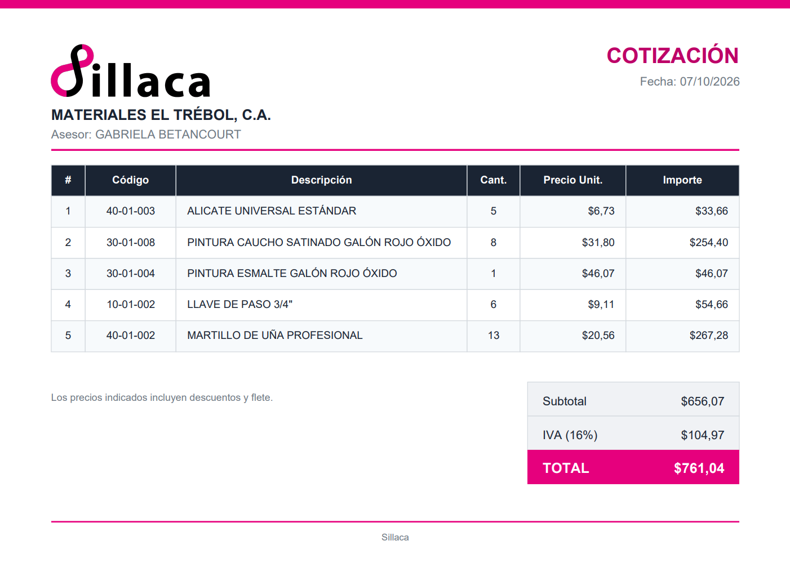
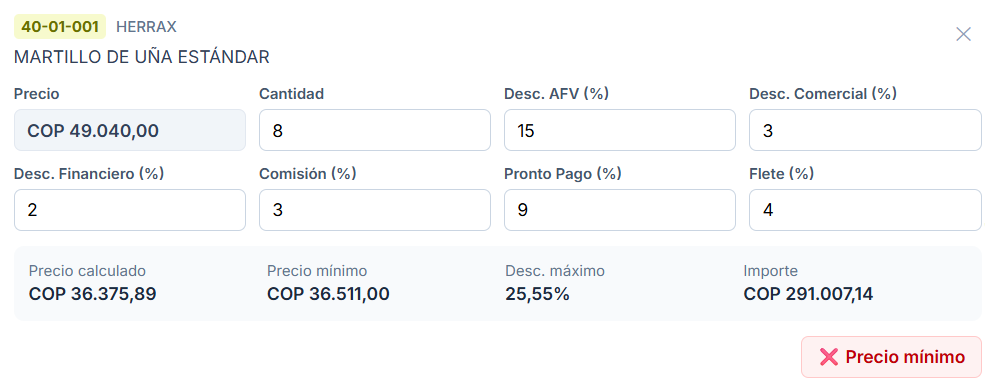
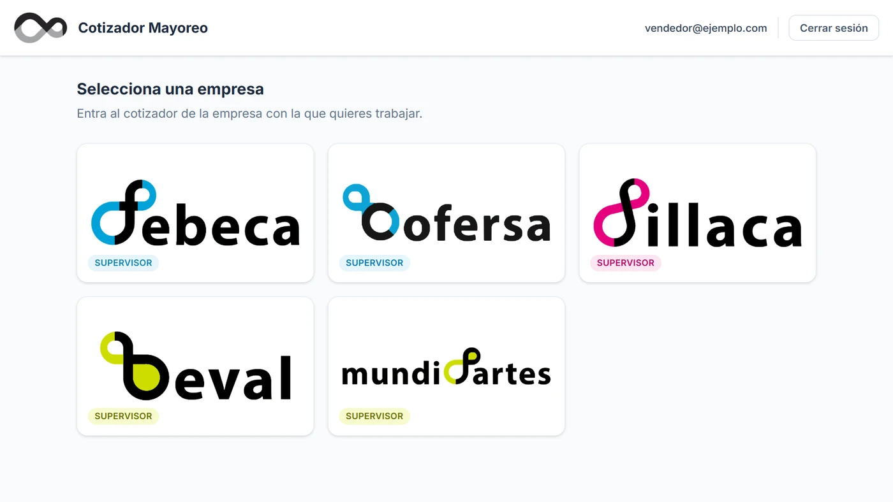

Quoting web application for the five companies of the **Mayoreo Group** — Febeca, Cofersa,
Sillaca, Beval and Mundipartes — spread across Venezuela, Costa Rica and Colombia. It started
as Febeca's quoting tool and ended up as a single application for the whole group: each
company is a module, with its own catalogue, customers, currency and price lists.

## The problem

To quote, salespeople looked prices up in *Catálogo de productos*, an application that did
only that: show an item's price. Products had to be searched one by one and each price
written down somewhere else, because the catalogue did not build any quote. Nor could it
apply the negotiated discounts or freight, so the final price was worked out by hand,
separately — let alone tell whether that result stayed above the accepted minimum price. And
it only showed a single price list.

In practice, building a quote meant doing the maths by hand, and while negotiating the
salesperson did not know whether the price they were reaching was acceptable to the company:
that came out afterwards, once it had already been offered to the customer.

And each company in the group solved this on its own, with different tools or none at all.

## The solution

An application where the quote is built product by product and **you know while
negotiating whether the price can be accepted**, not afterwards.

- **Product search** by code, description or brand, and **bulk loading**: paste a list of
  codes and the application adds the ones it finds and reports which are duplicated, which
  do not exist and which are ambiguous.
- **Several price lists**: you choose which one to quote from, and every calculation is
  redone on it.
- **Each product is a card** with its list price and the negotiation fields: five cascading
  discounts — AFV, commercial, financial, commission and early payment — plus freight. Below,
  the result: the calculated price next to the item's minimum price and the maximum discount
  it allows, and the line amount.
- **A pinned summary** on one side, with units, subtotal and total with tax, recalculated on
  every change.
- **Export to PDF, Excel or text**, the last one to paste straight into WhatsApp or an email.
  The PDF is addressed to the customer if one is picked.

*The PDF, with sample data. It carries the quoting company's brand and only what concerns
the customer: prices already negotiated, with no costs or internal discounts.*

**The traffic light answers what matters in a negotiation: whether it can be sold at that
price.** Each item brings its minimum price from the catalogue, and the card places it next
to the calculated price, the figure it constrains. The summary is judged on the whole
package, so a comfortable item can make up for a tighter one — that is how deals are
negotiated — while each card still flags its own floor in red. Trying to export a quote below
the acceptable level asks for confirmation first.

*A line in Colombian pesos. With the discounts applied, the calculated price lands just
below the minimum, and the traffic light flags it in red before it reaches the customer.*

**Each role sees what it needs to decide.** Supervisors negotiate only in terms of minimum
price and maximum discount, which is what the company wants discussed with the customer.
Managers also see cost, profit and margin, as does the administrator. The role also sets
which customers are available: a supervisor only finds their own reps' customers, and a
manager, the whole company's.

**Each company is data, not a separate build.** Currency, tax, price lists, colours, logo
and PDF letterhead live in a company registry, and all five read their catalogue in the same
format. Adding a company means adding an entry to that registry; the rest of the application
adapts on its own. It formats US dollars, Costa Rican colones and Colombian pesos, and each
module wears its own company's colours.

**Roles are per company, not per user.** The same person can be a manager in one company, a
supervisor in another and have no access to a third. That is why you sign in first — with
Google, limited to the group companies' accounts — and then pick the company, among the ones
that person is entitled to. Switching companies does not require signing out: each one is a
module of the same application, and moving between them takes a click.

*After signing in, every company the user can access, with their role in it. From any module
you come back here without signing out.*

## My role

I was the **sole developer** of the quoting tool: I designed the interface and handled the
frontend, data model, authentication and deployment. The catalogues and customer masters of
the five companies come through n8n webhooks set up by someone in the IT department, which
return the data from the ERP.

- **Frontend:** Next.js with static export, TypeScript and Tailwind CSS. Totals are not
  stored: they are derived from the lines, so they cannot go stale.
- **Pricing:** a single module that feeds the screen, the summary and the three exports, so
  the PDF, the Excel file and what the salesperson sees cannot disagree on a price.
- **Catalogue:** fetched on every load, to quote at current prices, and passed through a
  filter that drops what cannot be sold — display stands, promotional material, items with
  zero cost or price — before it pollutes the traffic light.
- **Authentication and permissions:** Supabase with Google sign-in, set up in Google Cloud
  and limited to the group's domains, and per-company memberships with a role in each.
- **Exports:** PDF branded for each company, Excel and plain text, with the same content in
  the same order in all three.
- **Tests:** 128 automated tests on pricing, catalogue and customer mapping, role
  permissions and the company registry: what, if it broke, would not show at a glance.

## Project status

In production since June 2026. It launched with Febeca, and management liked the result so
much that it decided to take it to the rest of the group: the other four companies joined one
by one, and all five use it daily.

It is an internal tool: it is deployed on the web and its code lives in a GitHub repository,
but out of confidentiality to the company this case does not link to the site or to the code.
For the same reason, the screenshots use sample data.
