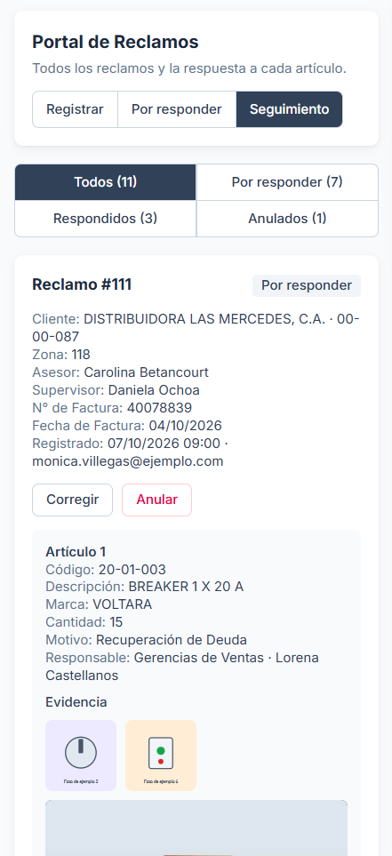
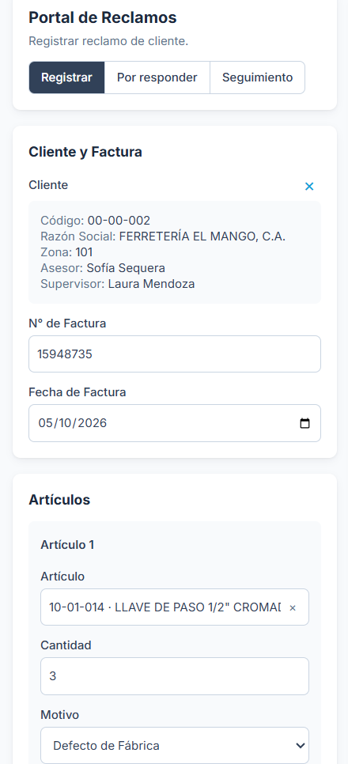

Internal web application at **Febeca** for handling the claims customers raise to request a
return. It lives inside the [sales supervisor portal](/en/projects/supervisor-portal/), like
[pickup order tracking](/en/projects/pickup-orders/), and shares its users and sign-in.

## The problem

Claims were handled by email. The customer complained to their sales rep; the rep wrote to
the person in charge of returns with the invoice, the item, the cause and the photos, and
that person forwarded the case to the department that had to decide, depending on the
reason: a manufacturing defect went to Purchasing, a shortage to Inventory Control, goods the
customer did not want to Sales Management.

A single claim could include items with different reasons, and each one had to reach a
different department. Photos travelled as attachments, the answer stayed in an email thread,
and nobody could see how many claims were waiting or who had to answer each one.

Email was good for notifying, not for managing. Each rep wrote up the claim their own way, so
sometimes the invoice, the item code or the photos were missing and had to be requested
again before the case could be reviewed. All the routing depended on one person reading each
email and forwarding it by hand: if they picked the wrong department or the email went
unread, the claim sat waiting without anyone noticing. And with no single record, finding
out where a case stood meant searching through threads and asking around, and counting how
many claims came in during a month, for what reason or how many went ahead was impossible
without going through the whole inbox.

## The solution

A portal with three screens, and each user sees only the ones that apply to them:

- **Register** — the customer, the invoice and one or more items. Each item carries its
  quantity, its reason and its evidence: photos and a video.
- **To answer** — the items assigned to whoever is signed in, oldest claim first. Each one
  is answered *Goes ahead* or *Does not go ahead*, and the latter requires a comment, which
  is what gets explained to the customer.
- **Tracking** — every claim with its status, who has to answer each pending item and the
  history of each case.

**Answers are per item, not per claim.** Each item's reason decides which department
reviews it, so a claim with one defective item and one surplus item splits on its own
between Purchasing and Inventory Control, and each department answers its own part. The
claim's status is not stored: it is derived from its items (to answer, under review or
answered), so it cannot contradict them.

**A list decides who answers, not a role.** Within each department, an item is assigned by
brand — that brand's buyer — or by the customer's region — that region's manager. The list
lives in the database and is resolved on the spot: if a buyer changes brands, the list is
edited and their pending items move on their own to whoever replaces them, without touching
a single claim.

*Tracking, with sample data. Each pending item names the department that reviews it and the
person who has to answer it, so nobody has to ask whose turn it is.*

**Nothing is deleted.** A claim can be corrected as long as no item has been answered,
because the approver decided on that data. After that it can only be voided, with a reason,
and it stays visible as voided. Every step — registered, corrected, answered, voided — is
kept in a history with who and when.

**Items are picked from the real catalogue**, not typed, so the code, the description and
the brand are always right. The catalogue holds thousands of products: the form requests it
as soon as it opens, in the background, while the rep fills in the customer and the invoice,
and keeps it on the phone for the day, so the rest of the time it is already there.

*Registration. Customer and item are picked from a list rather than typed, and each item
carries its own reason: that is what decides which department it goes to.*

## My role

I was the **sole developer** of the portal: I designed the flow and the interface and handled
the frontend, the data model and the access rules. The ERP data — the product catalogue and
the customer master — comes through two n8n webhooks set up by someone in the IT department.

- **Database:** PostgreSQL on Supabase, with the claims, their items and their history.
  Nothing writes to the tables directly: everything goes through database functions that
  validate the role, the customer, the dates and the evidence. Nobody can skip a rule, not
  even by calling the database from outside the application.
- **Permissions:** each role sees what concerns it, filtered by the database through
  row-level security policies, not by the interface. A sales rep can only file claims for
  customers in their own portfolio, derived from the zones assigned to them.
- **Evidence:** photos are resized and compressed on the phone before uploading, from
  several megabytes down to a few hundred kilobytes. The video is checked when it is picked
  — length and size — so a rep on mobile data does not find out at the end of an upload that
  it was no good. Everything goes to private storage and is shown through links that expire.
- **Customer and item details are copied into the claim** instead of referenced: a claim is
  the record of how things stood when it was made, even if the customer master changes later.

## Project status

It did not reach production: I left the company just before launch. It was practically
finished — registering, answering, tracking, corrections, voiding and the history all worked
end to end — and what remained was operational: creating the users and loading the list of
approvers, that is, who answers each reason, each brand's buyer and each region's manager.

It is an internal tool: its code lives in a GitHub repository, but out of confidentiality to
the company this case does not include links. For the same reason, the screenshots use sample
data.
