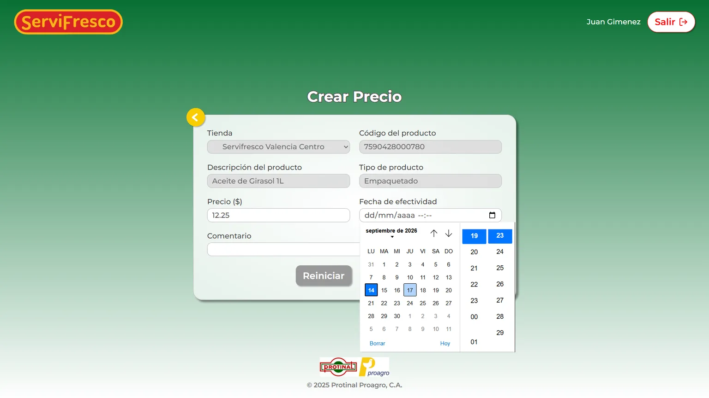
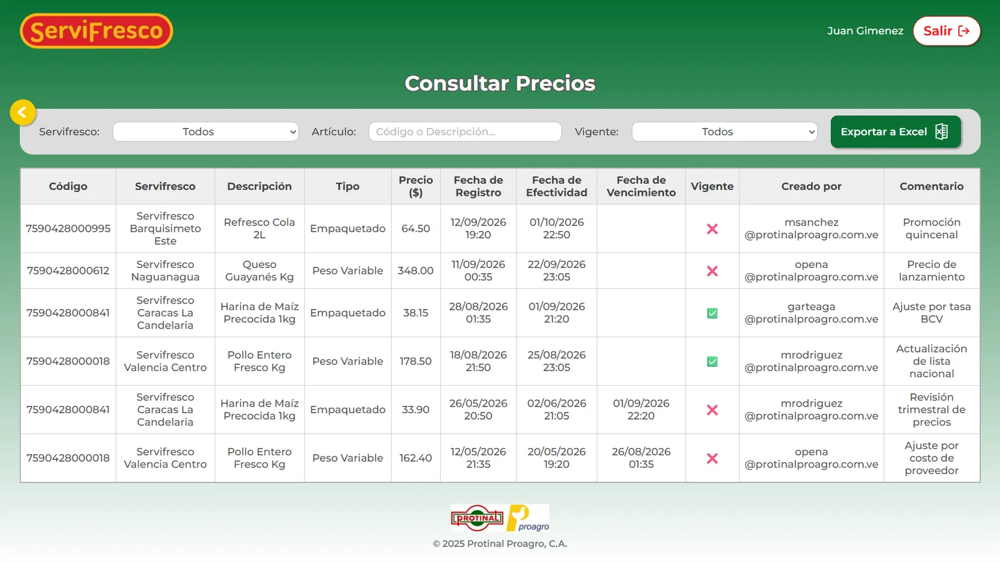
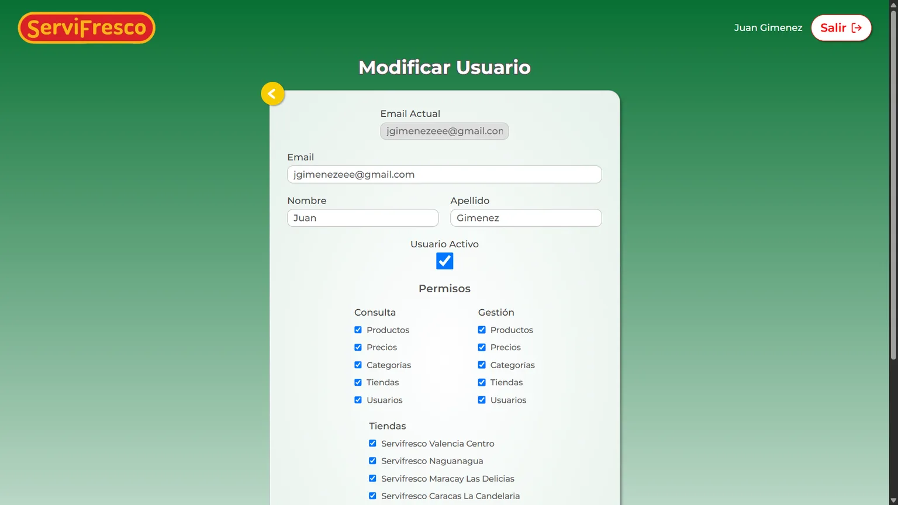

ServiFrescos is a web application built as an internship and thesis project for
**Protinal Proagro, C.A.**, designed to centralize the management of products and their
prices across the company's retail stores.

## The problem

Each of the **eleven retail stores** operated with its **own local database** to manage
products and prices.
This decentralized approach led to **frequent discrepancies** between the stores' data and
headquarters, along with slow, manual and error-prone update processes.

## The solution

A **web application** that centralizes management into a **central database**, administered
from a friendly interface. There are **five modules**: products,
prices, categories (brands, types, departments, groups and subgroups), stores and users.

The central database does not replace each store's local one: it connects to them and
replicates the changes made from the application, so the stores stop diverging from
headquarters without having to tear out what already worked.

Key features:

- **Scheduled prices:** when creating a price, you set the **date and time** from which it
  takes effect, so an adjustment can be loaded days in advance and switch over on its own.
- **Permissions per module and per store:** each user is granted read and manage rights
  module by module, and is also assigned the stores they can reach — which in practice
  decides whose prices they get to see or touch.
- **No deletion from the interface.** A company requirement: managing means creating and
  updating, never deleting. A record can only be removed by the database administrator
  from outside the application, and only when strictly necessary.
- **Export to Excel:** any listing exports exactly as displayed, with the search filters
  already applied.

*A new price does not replace the old one: it is scheduled. Until its effective date
arrives, the one in force is still the previous one.*

*The listing shows the price in force alongside those waiting their turn, and every record
keeps who created it and why — the trail the old process, spread across eleven databases,
left nowhere.*

*Read and manage are granted module by module; the assigned stores bound which prices each
user can act on.*

## My role

I was the project's **only developer** from start to finish, working alone and full stack:
I designed the interface and built the frontend, the backend and the centralized database.

- **Design (UI):** interface prototyping in Figma.
- **Frontend:** React, TypeScript and CSS.
- **Backend:** REST API with Django REST Framework.
- **Database:** centralized SQL Server.
- **Environment:** the whole application — frontend, backend and database —
  containerized with Docker Compose, so `docker compose up -d` brings the entire
  system up.

## Project status

Development reached an advanced, functional state, covering the application's full cycle.
Deployment and rollout to the stores fell outside the internship period, so the project was
not deployed to a real environment.
