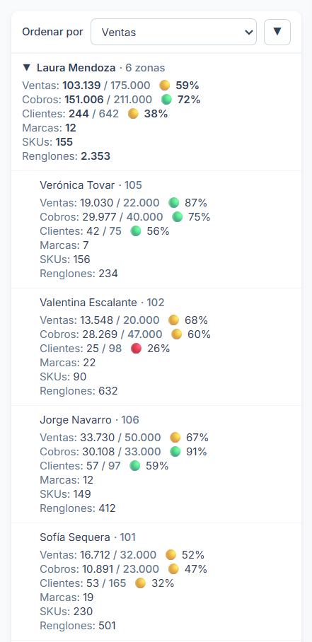
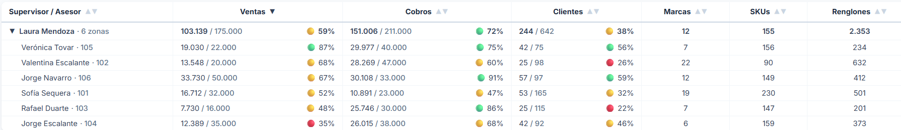

Internal portal for the sales force at **Febeca**. It is opened every day by ten
supervisors, three managers and the sales administration team.

## The problem

Once a day, each supervisor received an Excel file by email with their team's progress. The
data existed; what did not exist was a reasonable way to read it.

The file carried **the rows of every supervisor**, not just their own, plus the figures of
**other companies in the group**, which were of no use to them. Finding their own numbers
meant filtering by hand through a file full of other people's data, laid out in a structure
that was unintuitive and hard to read.

A report that arrived on time every day and that hardly anyone made use of. And that was
only the sales report: other things a supervisor needed to know did not even have a place to
be looked up.

## The solution

A portal where everyone signs in with their own account and **sees only their own team**.
Seven sections:

- **Dashboard** — the team's progress: sales and collections against budget, customer
  portfolio, activated customers and invoiced line items, each with its traffic light.
- **Accounts receivable** — what each customer owes, with the days of credit overdue.
- **Brands** — each supervisor's performance by brand in the current month.
- **Active terms** — the promotions and terms currently in force for each brand.
- **Paint** — paint sales broken down to the customer, with the thresholds of the
  category's sales contest.
- **Line items** — each sales rep's progress in the incentive contest and how far they are
  from the next tier.
- **Announcements** — notices from management: promotions, contests and news.

**The traffic light is measured against the month elapsed, not against the budget.** Knowing
that a rep is at 40% of their target says nothing on its own: on the 10th they are ahead, on
the 28th they are in trouble. Each indicator is compared with the share of the month that
has already gone by, so the screen answers *are we on track?* instead of *how much have we
done?*.

### The data does not arrive ready

None of the sources can be shown as they come. They are reports built for something else:
they carry raw data, with the columns that suit the system that produced them rather than
the ones a supervisor needs. Between that file and the screen there is work to do:
normalizing, joining different sources, applying the business rules and aggregating along
whichever dimension each view calls for.

That work is done **once, when the data is loaded**, not on every visit. A preliminary step
goes through the tens of thousands of rows of transaction detail and keeps only what each
screen needs; the browser receives the result already aggregated. Before, every browser
repeated it on every visit, only to reach the same result each time: the heaviest pages
took more than ten seconds to load. Today they take under two, and download around 100 kB
instead of almost 10 MB.

### A section that replaced a chat

**Active terms replaced a WhatsApp group.** The promotions in force for each brand used to
be announced there, mixed in with the supervisors' daily conversation, so finding a specific
term meant digging through the chat and trusting that nobody had changed it afterwards. Now
they live in one place, sorted by brand, and are looked up instead of remembered.

### Seven sections, for now

The portal was not born with these seven sections. It started in April with the Dashboard
alone and grew as needs appeared: Brands and Announcements were added in May; Accounts
receivable in June; Active terms in July; Paint in August; and Line items in September.

None of them was part of an initial plan: each one came in when it was needed. Today's list
is not the final one, just the one so far. Development is still active, and the portal will
keep adding sections the way it has from the start.

## My role

I am the **sole developer** on the project: interface design, frontend, data model and
deployment. Around 14,000 lines of TypeScript in five months, and still growing.

- **Frontend:** Next.js with the App Router, TypeScript and Tailwind CSS, designed mobile
  first: supervisors also open it on a desktop, but they mostly check it on their phones.
- **Installable app (PWA):** the portal installs on the phone as an app in its own right,
  not as a shortcut to a link. It gets its icon alongside the other apps, opens full screen
  without the browser bar and shows up separately in the task switcher. It deliberately
  caches nothing: an offline version could show another day's figures, and in a daily
  report that is worse than not loading.
- **Data:** precomputation of several spreadsheet sources, among them a transaction detail
  of tens of thousands of rows, which the browser receives already aggregated.
- **Authentication and permissions:** Supabase, with two main roles: the supervisor, who
  only sees the data of the sales reps they supervise, and the manager, who sees all the data
  without restriction. Roles are stored in PostgreSQL with row-level security policies, and
  the data in private storage that only responds to a signed-in session. The access rules
  live in a separate module so that no screen improvises its own.
- **Exports:** Excel and PDF of the filtered view, and a zipped batch with one file per
  supervisor.

*On the phone, the table stops being a table: each row becomes a card read from top to
bottom. Several columns on a narrow screen would force sideways scrolling to read.*

*The same team on the desktop, where it becomes a table again: there, what matters is
comparing reps with one another by reading down a column.*

## Project status

In production and in daily use for five months, with active development. It is used by the
ten supervisors, sales management and the five people in sales administration.

It is an internal tool: it is deployed on the web and its code lives in a GitHub
repository, but out of confidentiality to the company this case does not link to the site
or to the code. For the same reason, the screenshots use sample data.

Data loading is **manual and daily**, and it is worth being precise about how far that goes.
Direct API access to the ERP is not available to the department, so every day I extract the
reports and load them.

That is where the manual part ends. The files go in **exactly as they come out of the
system**: they are not edited, reordered or formatted. All the cleaning, the joins between
sources, the calculations and the aggregations are written in code and run on their own. The
alternative — hand-building an Excel file every day in the exact format the application
expects — would be slower, more fragile and would have to be repeated on every load. Within
the constraint there is, this is everything that could be automated.

If the company opens direct access to the data tomorrow — an API, an endpoint, a database
connection or a backend that serves it in real time — only the part that reads it today
would have to change. The tables, filters, traffic lights and exports would stay the same,
because they never knew where the data came from.
