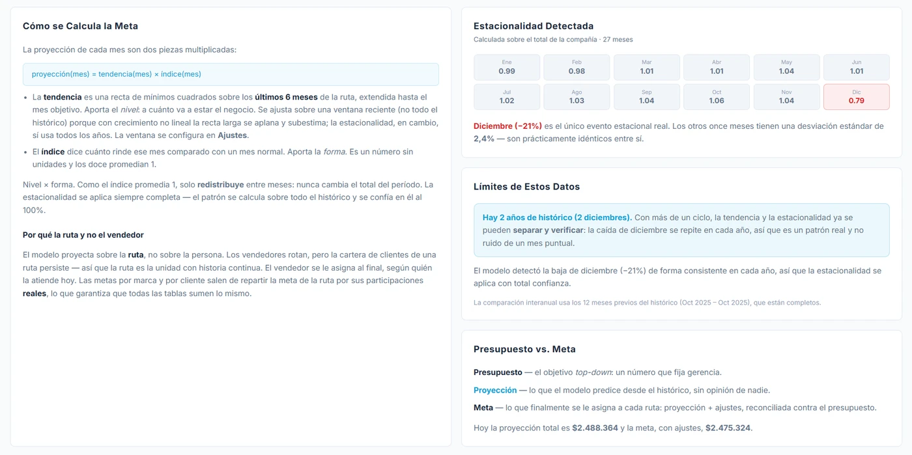
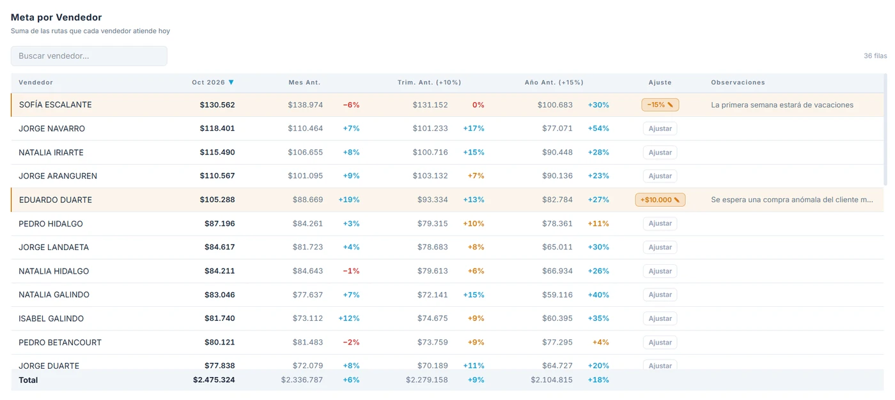
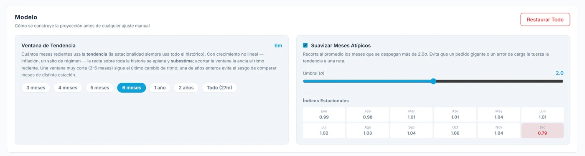

Aplicación web de **Febeca** para fijar las metas de la fuerza de ventas. Proyecta cuánto
debería vender cada vendedor a partir de su historia, la reconcilia con el presupuesto que fija
gerencia y la reparte en metas por marca, artículo y cliente, para el mes, el trimestre, el
semestre o el año.

## El problema

Las metas se fijaban en Excel. Se partía de lo vendido el año anterior, se le sumaba un
porcentaje de crecimiento parejo y se ajustaba a ojo. El presupuesto de cada vendedor se
colocaba a mano, de una manera bastante arbitraria, porque no había una forma confiable de
estimar, ni siquiera de manera aproximada, cuánto vendería el mes siguiente. El resultado era
que a muchos vendedores la meta les quedaba muy alta o muy baja.

Ese método tampoco distinguía entre el crecimiento real de un vendedor y un mes que siempre es
más flojo o más fuerte que los demás, así que trataba igual a quien venía creciendo y a quien
venía cayendo. Bajar la meta a cada marca y a cada cliente multiplicaba el trabajo, y era fácil
que las tablas dejaran de cuadrar entre sí. Y cuando a un vendedor se le subía o bajaba la meta
a mano, el motivo no quedaba escrito en ningún lado: a los tres meses quedaba el número, y nadie
recordaba de dónde había salido.

## La solución

Una aplicación que separa lo que dice la historia de lo que decide la gerencia.

- **La proyección** es lo que el modelo predice a partir del histórico, sin opinión de nadie.
- **El presupuesto** es el objetivo que fija gerencia. La aplicación sugiere uno —el mismo
  período del año anterior más el crecimiento esperado— y gerencia lo sobrescribe.
- **La meta** es lo que finalmente se le asigna a cada vendedor: la proyección más los
  ajustes, reconciliada contra el presupuesto. Un botón la cuadra con él.

**El modelo separa el nivel de la forma.** La proyección de cada mes es una tendencia por el
índice de ese mes. La tendencia es una recta ajustada sobre los últimos meses de cada vendedor
y aporta el nivel: a cuánto va a estar su venta. El índice estacional aporta la forma: hace
notar cuándo un mes vende notablemente más o menos que un mes promedio. Se calcula sobre la
venta total de la empresa y los doce índices promedian uno, así que solo reparten entre meses
y nunca cambian el total del período.

*La vista de Metodología, con datos de ejemplo. La aplicación explica su propio cálculo y
muestra la estacionalidad que detectó, así que quien recibe una meta puede ver de dónde sale.*

**Se proyecta la zona del vendedor, no la persona.** Una zona es el conjunto de clientes que
atiende un vendedor, y la mayoría de los vendedores tiene una sola, así que proyectar su zona
es proyectar su venta. La diferencia aparece cuando alguien rota: los vendedores cambian, pero
los clientes de una zona se mantienen, y con ellos la historia. La meta se le asigna al final
a quien atiende la zona hoy. Las metas por marca, artículo y cliente salen de repartirla según
lo que cada uno pesa de verdad en ella, y por eso todas las tablas suman lo mismo.

**Cada meta se compara con períodos anteriores.** Junto a la meta de cada vendedor está lo que
vendió antes, para ver de un vistazo cuánto se le pide crecer o cuánto decrecería, y los
colores señalan los casos en los que conviene detenerse antes de darla por buena.

**Los ajustes llevan su porqué.** Cualquier meta se ajusta en porcentaje o en monto —la de un
vendedor, una marca, un artículo, un cliente o una marca dentro de la zona de un vendedor— y
cada ajuste puede llevar una observación: que el vendedor estuvo de reposo, que se abrió un
cliente grande. El modelo la ignora, pero es el único sitio donde queda registrado el criterio.

*Metas por vendedor, con datos de ejemplo. Cada una junto a lo vendido antes, y dos ajustes
manuales con su observación: el motivo queda al lado del número que cambió.*

**El trabajo se guarda y se retoma.** Un estado guarda la configuración completa —período,
presupuesto, parámetros del modelo y ajustes—, no los resultados: al abrirlo, los números se
recalculan con los datos vigentes. Los estados que se refieren a meses ya cerrados se marcan
como vencidos y quedan como registro.

La aplicación exporta a Excel cada tabla y, aparte, el formato de metas que pide gerencia, al
detalle de cliente y marca, calculado con el mismo motor que se ve en pantalla.

## Mi rol

Fui el **único desarrollador** de la aplicación: diseñé el modelo de pronóstico y la interfaz,
y me encargué del frontend, el procesamiento de datos, la autenticación y el despliegue.

- **Modelo:** regresión lineal por mínimos cuadrados para la tendencia, índices estacionales
  sobre la serie sin tendencia, y un recorte opcional de meses atípicos para que un pedido
  excepcional no tuerza la recta de un vendedor. Los meses ya cerrados no se proyectan: se toma
  la venta real.
- **Datos:** el origen es un Excel de más de 90 MB, al detalle de cliente, artículo y mes. Un
  script lo convierte en un dataset compacto, sin repetir lo que se puede deducir, y la
  aplicación lo indexa con arreglos tipados para recalcular todas las tablas al instante con
  más de un millón de registros.
- **Seguridad:** el dataset son las ventas completas de la empresa, cliente por cliente. Vive
  en un almacenamiento privado y solo se entrega a usuarios con sesión y en una lista de
  autorizados, mediante un enlace firmado que caduca en dos minutos. La sesión se comprueba en
  el servidor, antes de entregar una sola página.
- **Frontend:** Next.js, TypeScript, Tailwind CSS y Chart.js, con una URL propia para cada
  vista y el histórico, la tendencia y la meta en un mismo gráfico.
- **Pruebas:** 106 pruebas automatizadas sobre el modelo, la agregación, los períodos, los
  estados guardados y las comparaciones.

*Los parámetros del modelo: cuántos meses usa la tendencia y si recorta los meses atípicos.
Cambiarlos recalcula todas las metas al instante.*

## Estado del proyecto

En uso desde julio de 2026, y marcó un antes y un después: desde entonces la empresa fija sus
metas de venta con esta aplicación, no con el Excel de antes. La usaba yo para calcular las
metas, y la gerencia, para seguir las tendencias y las proyecciones.

Es una herramienta interna: está desplegada en la web y su código vive en un repositorio de
GitHub, pero por confidencialidad de la empresa este caso no incluye enlaces ni al sitio ni
al código. Por la misma razón, las capturas usan datos de ejemplo.
