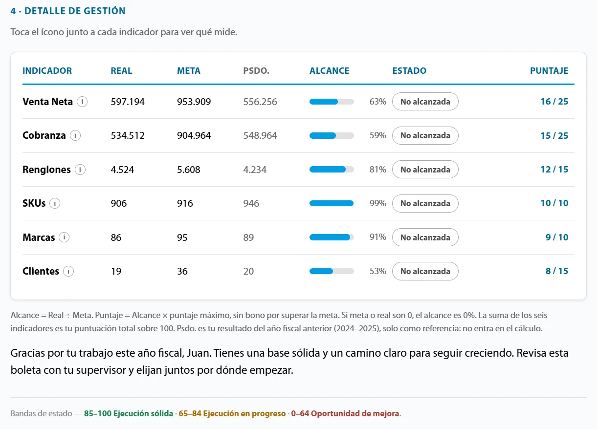
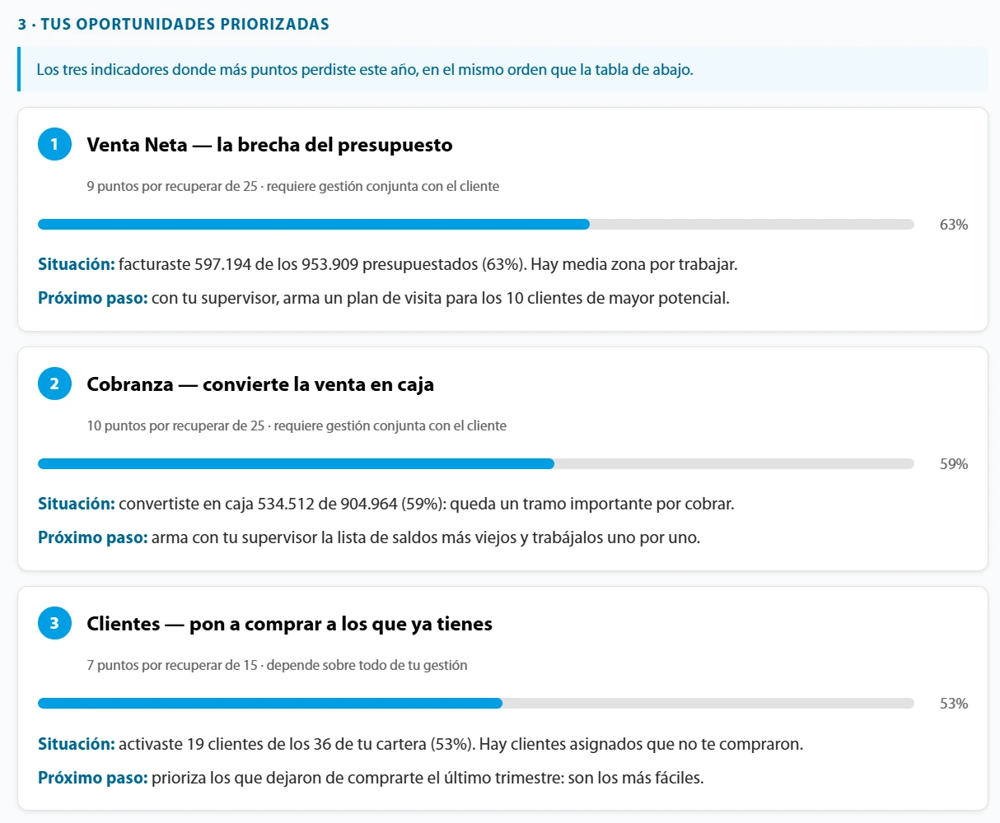

Generador de **boletas de gestión** para la fuerza de ventas del **Grupo Mayoreo**. Toma el
cierre de un período y evalúa a cada integrante de la fuerza de ventas en seis indicadores,
siguiendo su jerarquía —asesor, supervisor y gerente—. Escribe una lectura de los resultados
pensada para cada persona y entrega cada boleta en PDF y en HTML, por correo.

## El problema

Antes, la "boleta" que recibía cada asesor era literalmente un Excel con sus datos: venta,
cobranza, surtido y clientes. No era visual, ni atractiva, ni intuitiva, y el mismo archivo
contenía también los resultados de todos los demás. El envío, además, se hacía uno por uno.

Una tabla dice cuánto vendió alguien, pero no le dice qué tan bien le fue frente a lo que se
esperaba de él, cómo se compara con quienes trabajan en condiciones parecidas ni por dónde
empezar a mejorar. Y darle esa lectura a cada persona, por escrito, era inviable a mano: son
decenas de asesores por empresa, en varias empresas, y una evaluación redactada a mano tarda,
varía según quién la escribe y es difícil de mantener pareja entre una persona y otra.

## La solución

Una herramienta de línea de comandos que genera todas las boletas de una vez, a partir del
mismo archivo de cierre que ya producía la empresa. Cada persona recibe solo la suya.

**Seis indicadores, una puntuación sobre cien.** Venta neta, cobranza, renglones, SKUs, marcas y
clientes activados, cada uno con su peso. El alcance de cada indicador es el real sobre la meta
y aporta puntos hasta llegar a ella, nunca más: superar mucho uno no tapa la brecha de otro. La
puntuación total ubica a cada quien en una de tres franjas.

**Cada meta, con la vara que le corresponde.** Venta y cobranza se miden contra el presupuesto
de cada zona. Los indicadores de surtido se miden contra el estándar de su nivel, pero no todos
igual: los renglones crecen con el tamaño del equipo, así que su meta se pondera por tamaño;
los SKUs y las marcas saturan —el catálogo es finito y la misma marca en dos zonas cuenta una
sola vez—, así que su meta es un promedio simple. Ponderarlos les habría puesto a los equipos
grandes metas que no existen en la empresa.

*El detalle de gestión, con datos, pesos y franjas de ejemplo. El año anterior está a la vista
como referencia, pero no entra en el cálculo: la boleta se mide contra la meta, no contra
uno mismo.*

**Cada boleta se explica sola.** El texto de cada boleta se escribe a partir de sus números:
la apertura según la franja, lo que sostuvo mejor, dónde perdió más puntos y cómo le fue en
cada comparación. Las tres oportunidades son los indicadores donde más puntos se perdieron, y
cada una cierra con un próximo paso concreto. Hay varias redacciones por caso, elegidas de
forma determinista: regenerar una boleta no le cambia el texto a nadie, pero dos personas con
el mismo resultado no leen lo mismo.

*Las oportunidades, con datos de ejemplo. Cada una dice cuántos puntos hay por recuperar, la
situación con sus propias cifras y un próximo paso concreto: la boleta no se queda en el
diagnóstico.*

**Comparaciones que informan.** Cada asesor ve su posición nacional, regional y en su
coordinación. Un ámbito con menos de tres personas no se muestra: "1 de 1" no dice nada.

**Un juego de textos por nivel.** Las boletas de supervisor consolidan sus zonas y no
reutilizan las frases del asesor: el supervisor no visita clientes, dirige a quienes los
visitan, y su brecha casi siempre está en unas pocas zonas, no en todas.

**Dos formatos, el mismo documento.** Cada boleta sale en PDF y en HTML, y cada formato cumple
un papel. El PDF es el simple: cabe exactamente en dos hojas A4 y se abre en cualquier medio. El
HTML es el interactivo: autocontenido, se abre en cualquier teléfono sin depender de nada más y
agrega lo que el papel no puede tener. La puntuación cuenta hasta su valor al abrirla, las
barras de alcance se llenan a medida que aparecen en pantalla, cada indicador muestra su
explicación al tocarlo, y al pasar sobre una fila de la tabla se resalta también su
oportunidad.

## Mi rol

Fui el **único desarrollador** de la herramienta: diseñé el cálculo completo y los textos, y
me encargué de la lectura de datos, la generación y el envío. El estilo de la boleta lo
diseñé junto con la gerencia, ajustándolo para que mantuviera el estándar visual corporativo.

- **Datos:** lectura del Excel de cierre y cruce con el organigrama de cada zona. Cada fila se
  valida con Zod, una librería que comprueba en tiempo de ejecución que cada dato tenga el tipo
  y la forma esperados: una fila inválida se reporta y se omite, sin detener la corrida. Las
  exclusiones nunca son silenciosas: cada corrida imprime qué quedó fuera y por qué.
- **Períodos:** además del cierre anual, evalúa cualquier ventana de meses. Sobre un trimestre
  no existe el recuento distinto, así que esos indicadores se promedian entre los meses con
  datos de cada zona. Los textos no nombran el período a mano: usan marcadores que se
  resuelven según el período, para que una boleta trimestral no diga "año fiscal".
- **Textos:** más de 400 redacciones condicionales, y un catálogo generado con todas ellas, la
  condición en que aparece cada una y cuántas boletas la reciben, para que la gerencia valide
  los textos sin abrir cada boleta.
- **Render:** plantilla Handlebars convertida a PDF con Puppeteer, con un solo navegador y un
  grupo de páginas reutilizables. Las animaciones del HTML se desactivan en el PDF.
- **Fotos:** cada boleta lleva la foto de su titular. Se emparejan con los nombres por
  similitud, tolerando el orden, las erratas y el segundo nombre, y se recortan a primer
  plano de forma automática, anclando el corte en la coronilla y en la línea de hombros que
  marca el polo del uniforme.
- **Envío:** cada asesor recibe sus boletas por correo, con copia a su supervisor. Por defecto
  es una simulación; el envío real anota cada correo enviado para reanudar sin repetir, y se
  detiene si un correo no se parece al nombre de su dueño, porque mandarle a alguien la boleta
  de otro no se puede deshacer.
- **Varias empresas:** cuál se genera lo decide un solo ajuste. Lo que cambia entre ellas
  —color, metas fijas, ámbitos de ranking, exclusiones— vive en la configuración de cada una.

## Estado del proyecto

Se creó para Febeca, para evaluar el cierre del año fiscal, y a la gerencia le gustó tanto el
resultado que decidió llevar ese diseño al resto de las empresas del grupo. Con el tiempo dejó de usarse
solo para el año fiscal: también genera las boletas de otros períodos, como trimestres y meses.
Marcó un antes y un después en la entrega de las boletas: cada persona recibe la suya, sola,
clara y por correo, en lugar de un Excel compartido enviado a mano.

Es una herramienta interna y su código vive en un repositorio privado, así que por
confidencialidad de la empresa este caso no incluye enlaces. Por la misma razón, las capturas
usan datos inventados —personas, cifras, pesos y franjas de ejemplo—; el único rostro real es
el mío, en el lugar de un asesor.
